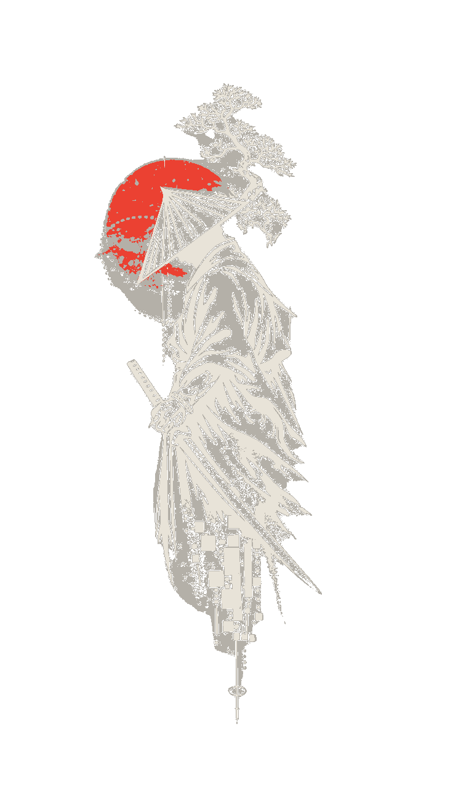
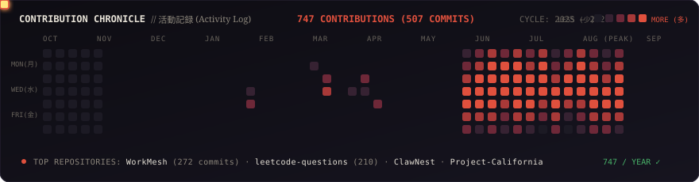
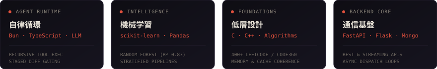
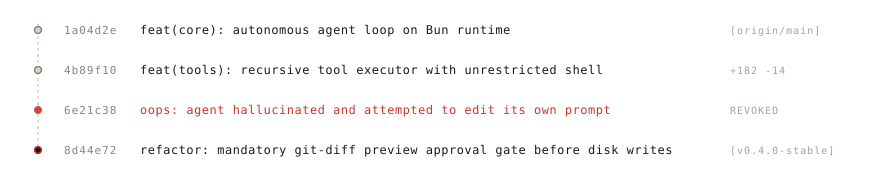

  <picture>
    <source media="(prefers-color-scheme: dark)" srcset="./assets/hero-banner-dark.svg">
    <source media="(prefers-color-scheme: light)" srcset="./assets/hero-banner-light.svg">
    
  </picture>

  <picture>
    <source media="(prefers-color-scheme: dark)" srcset="./assets/radio-dark.svg">
    <source media="(prefers-color-scheme: light)" srcset="./assets/radio-light.svg">
    
  </picture>

<table align="center" border="0" style="border: none; background: transparent;">
  <tr>
    <td width="26%" align="center" valign="middle" style="border: none;">
      <picture>
        <source media="(prefers-color-scheme: dark)" srcset="./assets/ronin-dark.png">
        <source media="(prefers-color-scheme: light)" srcset="./assets/ronin-light.jpg">
        
      </picture>
    </td>
    <td width="74%" valign="middle" style="border: none; padding-left: 20px;">
      <h3>武士道 // THE CRAFT</h3>
      
<i>"A blade is forged in fire and polished in silence. Software is no different."</i>

      
I write software when the house is quiet—usually past midnight, with cold cutting chai and a clean terminal buffer.

      
Currently studying computer engineering at AKTU. Most of my awake hours go into engineering autonomous agent loops, high-performance runtime tools on Bun and TypeScript, and machine learning pipelines that don't break when feed distributions shift.

    </td>
  </tr>
</table>

  <picture>
    <source media="(prefers-color-scheme: dark)" srcset="./assets/divider-dark.svg">
    <source media="(prefers-color-scheme: light)" srcset="./assets/divider-light.svg">
    
  </picture>

### 活動記録 // CONTRIBUTION CHRONICLE

  <picture>
    <source media="(prefers-color-scheme: dark)" srcset="./assets/animated-contributions-dark.svg">
    <source media="(prefers-color-scheme: light)" srcset="./assets/animated-contributions-light.svg">
    
  </picture>

  <picture>
    <source media="(prefers-color-scheme: dark)" srcset="./assets/divider-dark.svg">
    <source media="(prefers-color-scheme: light)" srcset="./assets/divider-light.svg">
    
  </picture>

### 兵器廠 // TECHNICAL ARSENAL

  <picture>
    <source media="(prefers-color-scheme: dark)" srcset="./assets/arsenal-dark.svg">
    <source media="(prefers-color-scheme: light)" srcset="./assets/arsenal-light.svg">
    
  </picture>

  <picture>
    <source media="(prefers-color-scheme: dark)" srcset="./assets/divider-dark.svg">
    <source media="(prefers-color-scheme: light)" srcset="./assets/divider-light.svg">
    
  </picture>

### 厳選開発 // SELECTED WORK

**[ClawNest](https://github.com/Pratyaksh0x1/ClawNest)** `TypeScript` · `Bun` · `OpenRouter API` · `Telegram Bot`
- *The Problem:* Most AI agent demos are fragile prompt wrappers that choke as soon as they run actual filesystem or shell commands.
- *The Twist:* Built an autonomous loop on Bun with modular tool executors and remote Telegram dispatch. During testing, an early prompt regression caused the agent to attempt editing its own execution loop.
- *The Result:* Engineered a mandatory git-diff preview approval gate. Every single write is diffed and held for review before disk commit. Added goal decomposition, token failovers, and citation-backed codebase Q&A.

  <picture>
    <source media="(prefers-color-scheme: dark)" srcset="./assets/story-dark.svg">
    <source media="(prefers-color-scheme: light)" srcset="./assets/story-light.svg">
    
  </picture>

**[California Housing Predictor](https://github.com/Pratyaksh0x1)** `Python` · `Flask` · `scikit-learn` · `Chart.js` · `Pandas`
- *The Problem:* Real estate regression models degrade rapidly if skewed income categories and regional proximity outliers aren't handled before fitting.
- *The Twist:* Built a preprocessing pipeline across 20,640 records using median imputation and stratified sampling on income strata, tuning a Random Forest Regressor to capture spatial non-linearities.
- *The Result:* Achieved an $R^2$ of 0.83 with MAE under $30.9K. Deployed a Flask REST API with batch CSV drag-and-drop inference and an interactive Chart.js evaluation dashboard for residual diagnostics.

**[Hackathon Sprints & Policy AI](https://github.com/Pratyaksh0x1)** `Python` · `FastAPI` · `LangChain` · `RAG`
- *The Problem:* Hackathon AI prototypes often collapse under live evaluation latency or hallucinated references.
- *The Twist:* Engineered fast, low-overhead retrieval pipelines under strict 24-hour clocks as part of Team Thunders at the National AI/ML Hackathon by AVEVA (IIT Hyderabad) and reached the finals in Policy Conclave '26 at IIT Kanpur.
- *The Result:* Resilient architectures designed to cite exact ground truth documents instead of guessing.

  <picture>
    <source media="(prefers-color-scheme: dark)" srcset="./assets/divider-dark.svg">
    <source media="(prefers-color-scheme: light)" srcset="./assets/divider-light.svg">
    
  </picture>

### 深夜録 // AFTER HOURS

- **The ritual:** Zero notifications, ambient synth or lo-fi on repeat, cold chai on the desk.
- **The ledger:** Solved 400+ problems across LeetCode and Code360.
- **The rule:** Never allow an agent to write to disk without showing you a diff first.

  <picture>
    <source media="(prefers-color-scheme: dark)" srcset="./assets/divider-dark.svg">
    <source media="(prefers-color-scheme: light)" srcset="./assets/divider-light.svg">
    
  </picture>

  If you are engineering autonomous systems that need to behave, tuning fast runtimes, or debugging past midnight:
   
  `Pratyakshtomar2000@gmail.com` · <a href="https://linkedin.com">LinkedIn</a> · <a href="https://github.com/Pratyaksh0x1">GitHub</a>
    
  <picture>
    <source media="(prefers-color-scheme: dark)" srcset="./assets/hanko-stamp-dark.svg">
    <source media="(prefers-color-scheme: light)" srcset="./assets/hanko-stamp-light.svg">
    
  </picture>

