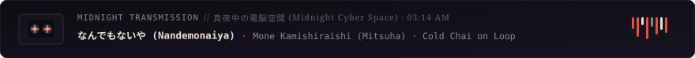
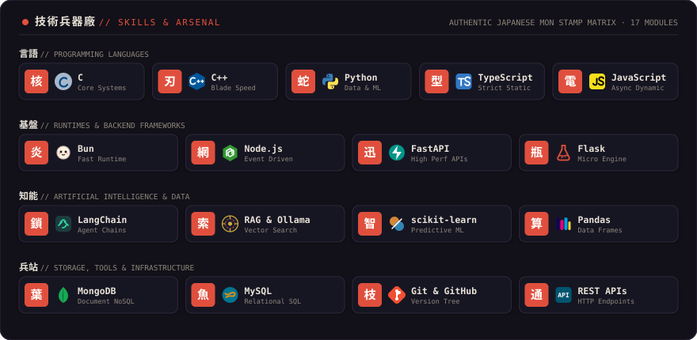

  <picture>
    <source media="(prefers-color-scheme: dark)" srcset="./assets/hero-banner-dark.svg">
    <source media="(prefers-color-scheme: light)" srcset="./assets/hero-banner-light.svg">
    
  </picture>

  <picture>
    <source media="(prefers-color-scheme: dark)" srcset="./assets/radio-dark.svg">
    <source media="(prefers-color-scheme: light)" srcset="./assets/radio-light.svg">
    
  </picture>

  <picture>
    <source media="(prefers-color-scheme: dark)" srcset="./assets/divider-dark.svg">
    <source media="(prefers-color-scheme: light)" srcset="./assets/divider-light.svg">
    
  </picture>

### ⚡ Live Contribution Activity (活動記録 // Contributions)

  <picture>
    <source media="(prefers-color-scheme: dark)" srcset="./assets/github-contribution-grid-snake-dark.svg">
    <source media="(prefers-color-scheme: light)" srcset="./assets/github-contribution-grid-snake.svg">
    
  </picture>

  <picture>
    <source media="(prefers-color-scheme: dark)" srcset="https://streak-stats.demolab.com/?user=Pratyaksh0x1&theme=dark&background=0E0D13&border=262232&stroke=E0503D&ring=E0503D&fire=E0503D&currStreakNum=E8E3D8&sideNums=E8E3D8&sideLabels=8C867B&currStreakLabel=E0503D&dates=66615A">
    <source media="(prefers-color-scheme: light)" srcset="https://streak-stats.demolab.com/?user=Pratyaksh0x1&theme=light&background=F9F6F0&border=DDD6C8&stroke=C8382B&ring=C8382B&fire=C8382B&currStreakNum=1C1B19&sideNums=1C1B19&sideLabels=756F67&currStreakLabel=C8382B&dates=8C867C">
    
  </picture>

  <picture>
    <source media="(prefers-color-scheme: dark)" srcset="./assets/divider-dark.svg">
    <source media="(prefers-color-scheme: light)" srcset="./assets/divider-light.svg">
    
  </picture>

### ⚔️ Technical Arsenal (技術兵器廠 // Tech Stack)

  <picture>
    <source media="(prefers-color-scheme: dark)" srcset="./assets/skills-matrix-dark.svg">
    <source media="(prefers-color-scheme: light)" srcset="./assets/skills-matrix-light.svg">
    
  </picture>

  <picture>
    <source media="(prefers-color-scheme: dark)" srcset="./assets/divider-dark.svg">
    <source media="(prefers-color-scheme: light)" srcset="./assets/divider-light.svg">
    
  </picture>

### ⛩️ Transmission & Contacts (通信確立 // Connect)

  
  &nbsp;
  
  &nbsp;
  
  &nbsp;
  

<table align="center" border="0" style="border: none; background: transparent; width: 100%;">
  <tr>
    <td align="left" width="50%" style="padding: 12px; border: 1px solid #262232; border-radius: 8px;">
      <b>🌐 PORTFOLIO (作品集)</b> 
      <a href="https://pratyaksh-ai-ten.vercel.app"><b>pratyaksh-ai-ten.vercel.app</b></a> 
      Interactive AI Demos, Systems Showcase &amp; Neural Visualizations
    </td>
    <td align="left" width="50%" style="padding: 12px; border: 1px solid #262232; border-radius: 8px;">
      <b>💼 LINKEDIN (職歴)</b> 
      <a href="https://www.linkedin.com/in/pratyaksh-tomar-112bb6337/"><b>in/pratyaksh-tomar-112bb6337</b></a> 
      Professional Network, Engineering Experience &amp; Collaboration
    </td>
  </tr>
  <tr>
    <td align="left" width="50%" style="padding: 12px; border: 1px solid #262232; border-radius: 8px;">
      <b>⚔️ LEETCODE (算法演習)</b> 
      <a href="https://leetcode.com/u/PratyakshTomar/"><b>leetcode.com/u/PratyakshTomar</b></a> 
      400+ Problems Solved across LeetCode &amp; Code360 · DSA Core
    </td>
    <td align="left" width="50%" style="padding: 12px; border: 1px solid #262232; border-radius: 8px;">
      <b>⭐ TOP REPOSITORY (旗艦開発)</b> 
      <a href="https://github.com/Pratyaksh0x1/ClawNest"><b>Pratyaksh0x1/ClawNest</b></a> 
      Autonomous AI Agent System on Bun with Diff Approval &amp; Tool Exec
    </td>
  </tr>
</table>

  Direct Transmission: <a href="mailto:pratyakshtomar2000@gmail.com"><b>pratyakshtomar2000@gmail.com</b></a>
    
  <picture>
    <source media="(prefers-color-scheme: dark)" srcset="./assets/hanko-stamp-dark.svg">
    <source media="(prefers-color-scheme: light)" srcset="./assets/hanko-stamp-light.svg">
    
  </picture>

